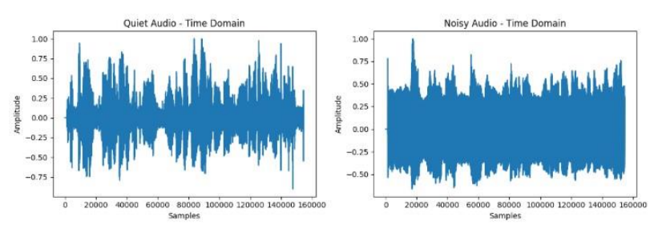
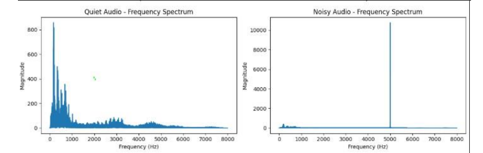
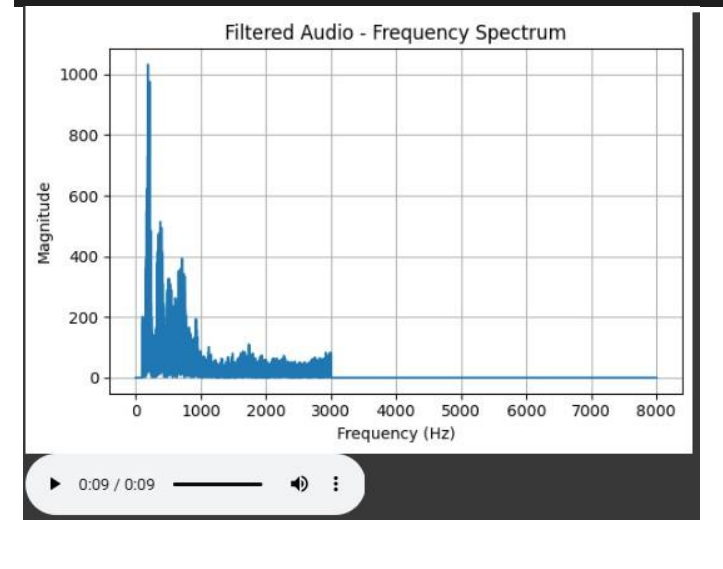
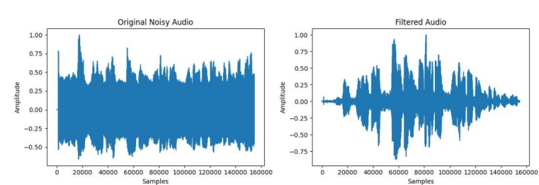

# # 🎧 Audio Signal Processing using Python

## 📌 Overview
This project focuses on analyzing and filtering real-world audio signals using Digital Signal Processing (DSP) techniques in Python. 

Using Fast Fourier Transform (FFT), the audio signal is converted from the time domain to the frequency domain, allowing identification and removal of unwanted noise components. The filtered signal is then reconstructed using inverse FFT, resulting in improved speech clarity.

---

## 🎯 Objectives
- Analyze audio signals in time and frequency domains  
- Apply FFT for spectral analysis  
- Remove noise using frequency-domain filtering  
- Reconstruct clean audio using inverse FFT  

---

## 🛠️ Technologies Used
- Python  
- NumPy  
- Librosa  
- Matplotlib  
- SoundFile  

---

## ⚙️ Methodology

1. **Audio Acquisition**
   - Recorded two audio samples: quiet and noisy environments  

2. **Preprocessing**
   - Normalized audio signals  
   - Matched signal lengths for comparison  

3. **Time-Domain Analysis**
   - Visualized amplitude vs samples  

4. **Frequency-Domain Analysis**
   - Applied Hamming window  
   - Computed FFT to obtain frequency spectrum  

5. **Noise Filtering**
   - Removed frequencies:
     - Below **100 Hz** (low-frequency noise)  
     - Above **3000 Hz** (high-frequency noise)  

6. **Signal Reconstruction**
   - Applied inverse FFT (IFFT)  
   - Normalized output signal  

---

## 📊 Results & Visualization

### 🎵 Time Domain Signals

### 📈 Frequency Spectrum (FFT Analysis)

### 🔊 Noise Filtering Result

### 🔁 Comparison (Original vs Filtered)

## 📄 Project Report
Detailed explanation of methodology, FFT analysis, filtering process, and results is available in the report.

👉 [Click here to view](docs/dsp-report.pdf)
---

## 📈 Key Insights
- Noisy signals exhibit wide frequency spread across spectrum  
- Desired speech signals mainly lie between **100 Hz – 3000 Hz**  
- Frequency-domain filtering effectively removes unwanted components  
- Filtered audio shows significant improvement in clarity  

---

## 📁 Project Structure
